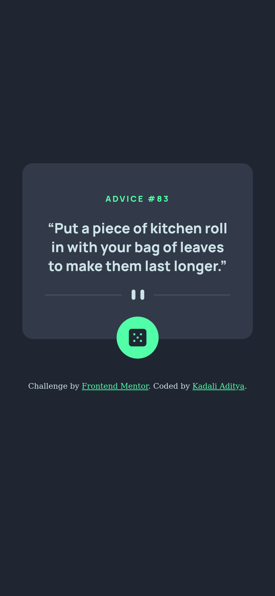
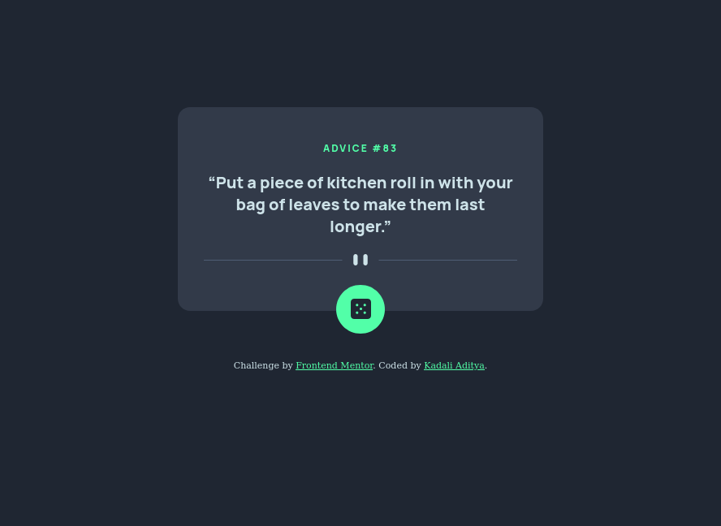

# Frontend Mentor - Advice generator app solution

## Overview

This is a solution to the [Advice generator app challenge on Frontend Mentor](https://www.frontendmentor.io/challenges/advice-generator-app-QdUG-13db). Frontend Mentor challenges help you improve your coding skills by building realistic projects.

### The challenge

- View the optimal layout for the app depending on their device's screen size
- See hover states for all interactive elements on the page
- Generate a new piece of advice by clicking the dice icon

### Screenshot
    

### Links

- [Source](https://github.com/Adityakadali/Advice-generator-app)
- [Live site](https://adityakadali.github.io/Advice-generator-app/)

## My process

First I've structured HTML document according to the design and I went with mobile first approach and designed the mobile layout and then tweaked a little bit for desktop layout. and atlast I added the script to ping api and fetch the advice object. with that I've manipulated DOM to show what I wanted.

### Built with

- Semantic HTML5 markup
- CSS Custom properties
- Flexbox
- Mobile-first workflow
- JavaScript

### What I learned

I learned to display different images for different screen sizes without using JavaScript or CSS Mediaqueries with source tag.

```html
<picture>
  <source
    media="(min-width: 400px)"
    srcset="./images/pattern-divider-desktop.svg"
  />
  <source
    media="(min-width: 300px)"
    srcset="./images/pattern-divider-mobile.svg"
  />
  
</picture>
```

## Author

- Aditya Kadali
- Twitter [@adityakadali](https://www.twitter.com/adityakadali)
